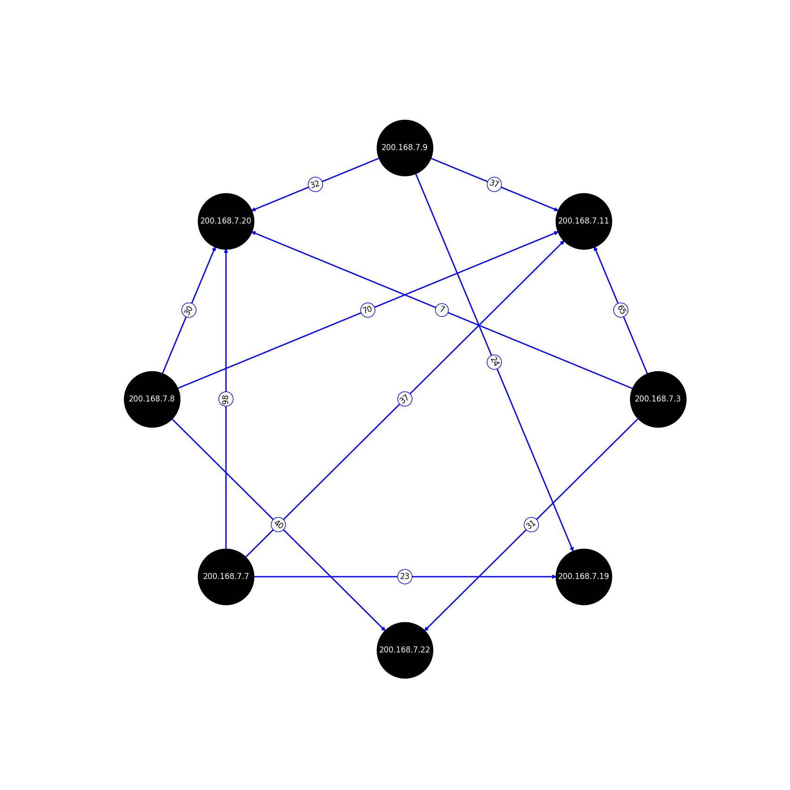

## Description

The script generates an image `graph.png` in the program directory, as well as `graph-<timestamp>.png` in the **images** folder (folder **pcap** contains example pcap files). For Windows hosts.

## Usage

Check for `tshark.exe` at `C:\Program Files\Wireshark\` and change `root` folder in script.
  
```bash
python PcapGraphBuilder.py
```

## Requirements

```bash
pip3 install -r requirements.txt
```

## Result


